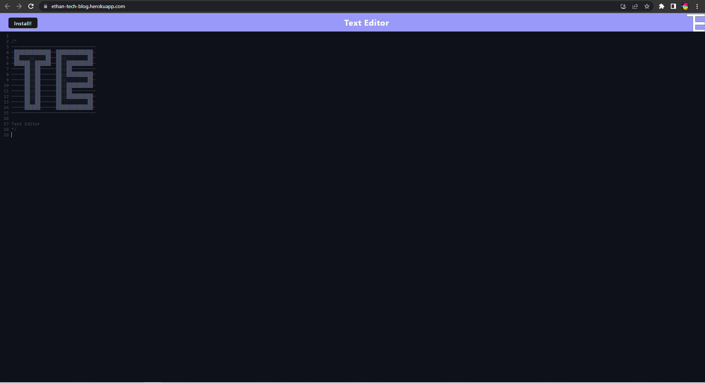

# Text Editor 

## Licencing
 
 
This licence is covered under the licence of MIT Licence. 

## Table Of Contents
[licencing](#licencing) 

[description](#description) 

[Installation](#installation) 

[Usage](#usage) 

[Contributing](#contributing) 

[Tests](#tests) 

[Questions](#questions) 

## Description
The purpose of this project is to allow a user to use a browser based text editor. This application also allows a user to install the text editor for offline use.  

## Installation
To correctly install this project click [here](https://ethan-tech-blog.herokuapp.com/) and click on the install button to install the client side application. Or for a developer, either download the code as a zip for git fork the repostiory. 

## Usage
To use this project Either click [here](https://ethan-tech-blog.herokuapp.com) and start typing away or once a local copy of the repository has been downloaded type `npm i` in the root command line of the repository, then run `npm run start:dev`, then type `npm run start`. The application will then be ready in the browser on localhost:3000. The application should look like the following:   

## Contributing 
To contribute to this project please contact me on ethan.godley@hotmail.com in regards to any contributions. 

## Tests
To test the project Please run manual tests as tests have not been premande.  
 
## Questions 
Please find the link to my github profile below, along with my email address should a user or developer have any further questions 

https://github.com/ethangodley ethan.godley@hotmail.com
